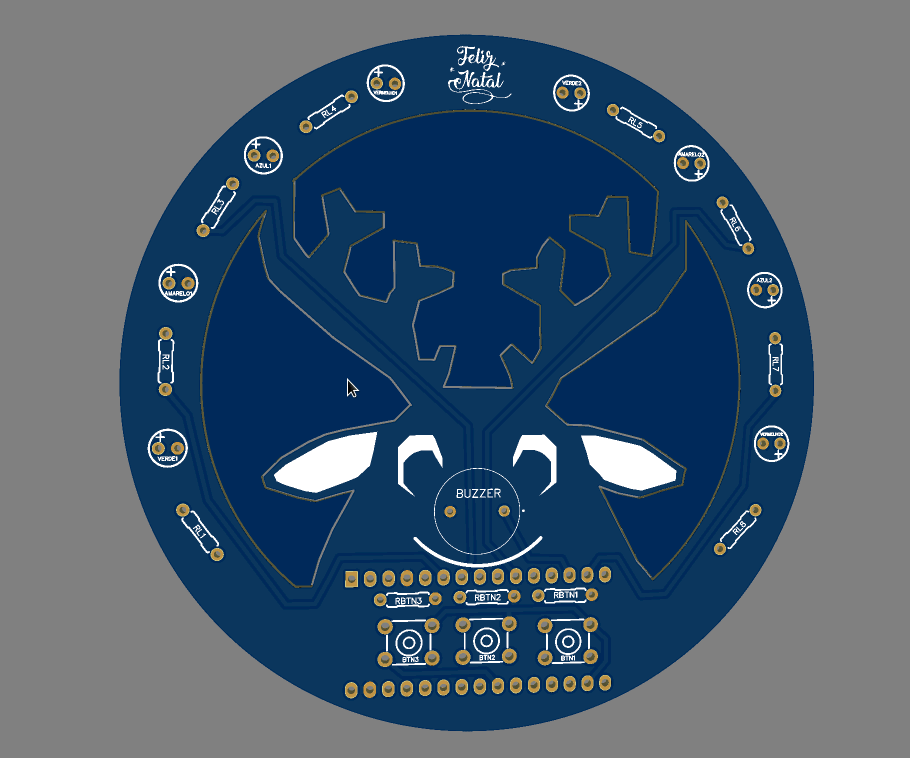

# Repositório de PCBs
Este repositório contém projetos de placas de circuito impresso (Printed Circuit Board, em inglês) desenvolvidas por mim.

Você pode encontrar uma documentação de cada projeto em sua respectiva pasta, mas se quiser ter uma ideia mais geral, dê uma olhada nas imagens abaixo. 

<a href = "./PCB-natalina-2021">
PCB Natalina 2021 - Desenvolvida para o Julialabs PCB Challange

</a>

