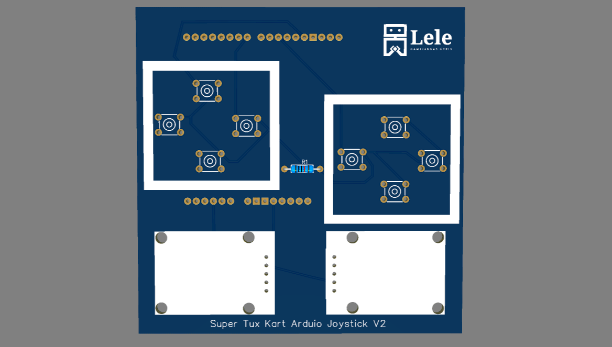
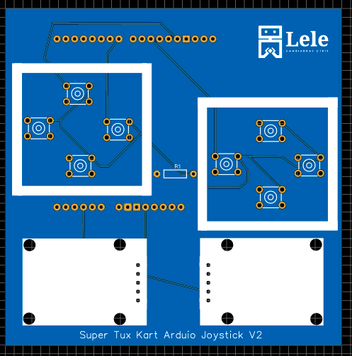

# Super Tux Kart Joystick

## O que é este projeto?
Este projeto se trata de uma placa de circuito impresso (PCB) na forma de um shield para arduino leonardo que tem o intuito de melhorar o projeto de um joystick desenvolvido anteriormente para jogar o jogo Super Tux Kart.

[Clique aqui para ver o projeto original](https://github.com/LelePG/simple-arduino-joystick).

O projeto foi desenvolvido com o software **Easy EDA** e está disponível no compartilhamento da PCB way. Para acessá-lo, [clique aqui](https://www.pcbway.com/project/shareproject/Super_tux_kart_joystick_88975a4b.html).

## Como este projeto está estruturado?
* Gerber_PCB_Joystick.zip: arquivos gerber do projeto;
* Project_Joystick.zip: arquivos de desenvolvimento do projeto;
* Pasta imagens: contém imagens do projeto;

## Componentes necessários para o projeto
A lista de componentes detalhada deste projeto pode ser encontrada na Mouser na forma de um carrinho de compras [clicando aqui.](https://www.mouser.com/ProjectManager/ProjectDetail.aspx?AccessID=6EB08A1949)

Optei pela utilização de componentes PTH neste projeto porque o processo de solda é mais simples.

|Componente|Quantidade|Observação|
|:----------:|:----------:|:----------:|
| [Arduino Leonardo](https://br.mouser.com/ProductDetail/Arduino/A000052?qs=sGAEpiMZZMsUJpHmmVieqDf6SOxC0arbjUqeZcOWR0Q%3D)  | 1  | |
| [Resistor de 100 ohms](https://www.mouser.com/ProductDetail/594-5043ED100R0F)  | 1 | usado no botão |
| [Chave tátil](https://www.mouser.com/ProductDetail/506-1-1825910-4) | 8 |   |
|[Módulo de Joystick](https://br.mouser.com/ProductDetail/375-JOY-01)|2||

